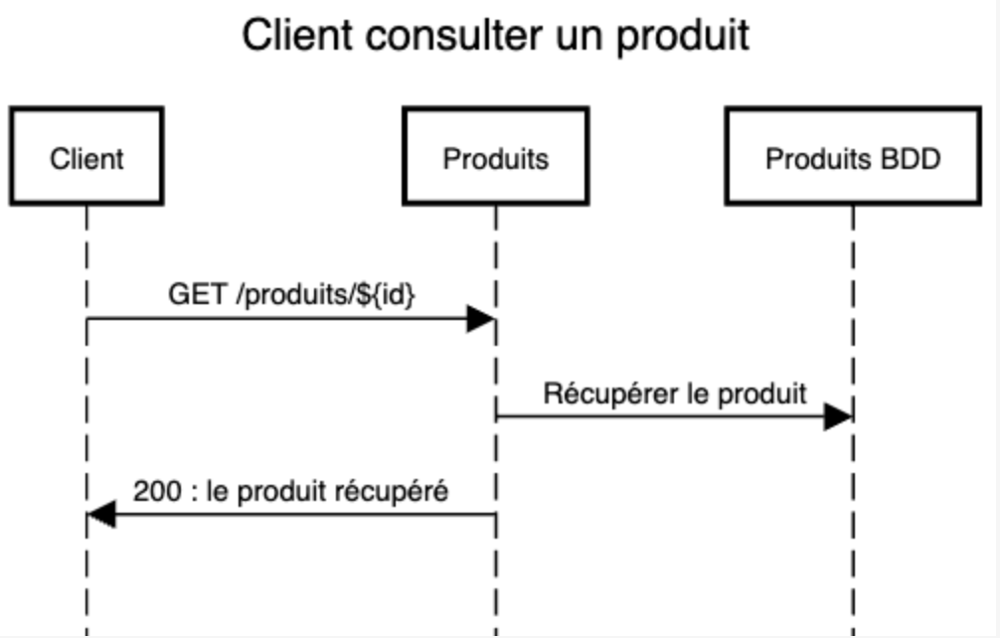
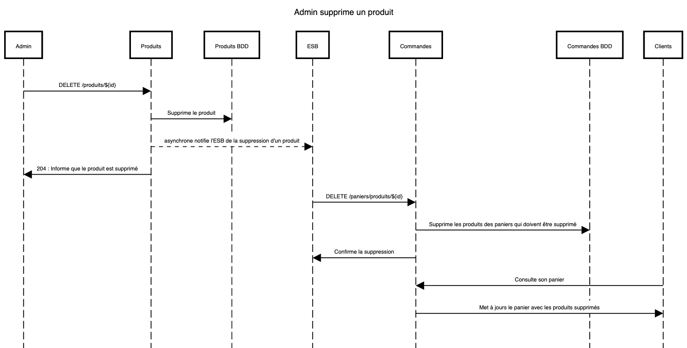

# Init

Pour démarrer le PC, vous pouvez simplement faire la commande suivante : ./init.sh

Celui-ci vous connecteras avec une clé permettant seulement de download les images du registre du projet, et démarreras ensuite les docker compose.

# Projet : site de vente de vêtements

---

## Présentation du sujet :

Développement d'une application architecturée en micro-services d'un site de vente de vêtements, appelée Laurich'App.

---

## Micro-services :

L'application se décompose en 5 micro-services obligatoires et 2 optionnels :

1. **Obligatoires** :
   - Service de notifications
   - Service d'authentification
   - Service de gestion de réapprovisionnement
   - Service de gestion du catalogue
   - Service de gestion des commandes
2. **Optionnels** :
   - Service de gestion de carte cadeau
   - Service de gestion de paiement

---

## Acteurs :

Les acteurs principaux sont :

- Client
- Gestionnaire

---

## Tables des BDD :

Les différentes tables utilisées dans les bases de données sont :

1. BDD **Notification** :
   - _A COMPLETER_
2. BDD **Authentification** :
   - Utilisateurs
   - Tokens
   - Roles
3. BDD **Gestion_Reapprovisionnement** :
   - Bon_de_commande_Reapprovisionnement
   - Fournisseurs
   - Produits_Fournisseurs
4. BDD **Gestion_Catalogue** :
   - Produits_Catalogue
   - Catégorie_Catalogue
5. BDD **Gestion_Commandes** :
   - Commandes
   - Produits_Commande
   - Catégorie_Commande
   - Couleur_Commande
6. _(**Optionnel**)_ BDD **Gestion_Carte_Cadeau**
7. _(**Optionnel**)_ BDD **Gestion_Paiements**

## Liens :

- Un utilisateur a un ou plusieurs roles
- Un produit_commande a une catégorie
- Un produit_commande a une unique couleur
- Un produit_catalogue a une catégorie
- Un produit_catalogue a une ou plusieurs couleurs séparées par des ';'
- Un panier est composé d'un ou plusieurs produit_catalogue
- Un produit_catalogue devient un produit_commande quand il est dans panier
- Une commande est un panier validé et est donc composé d'un ou plusieurs produit_commande

---

## Cas d'utilisation :

### Client :

- Un client peut se créer un compte
- Un client peut modifier les informations de son profil
- Un client peut se connecter
- Un client peut se déconnecter
- Un client peut consulter un produit du catalogue
- Un client peut ajouter un produit du catalogue au panier
- Un client peut supprimer un produit du panier
- Un client peut valider son panier
- Un client peut passer une commande
- Un client peut ajouter un produit en favoris
- Un client peut retirer un produit en favoris
- Un client peut consulter la liste de favoris
- Un client peut consulter sa commande en cours
- Un client peut consulter l'historique des commandes
- _(**Optionnel**)_ Un client peut rechercher un produit du catalogue, par mots-clés
- _(**Optionnel**)_ Un client peut procéder au paiement de sa commande
- _(**Optionnel**)_ Un client peut utiliser une carte cadeau en tant que moyen de paiement
- _(**Optionnel**)_ Un client peut acheter une carte cadeau

### Gestionnaire :

- Un gestionnaire peut se connecter
- Un gestionnaire peut se déconnecter
- Un gestionnaire peut ajouter un nouveau produit au catalogue
- Un gestionnaire peut modifier/mettre à jour un produit du catalogue
- Un gestionnaire peut supprimer un produit du catalogue
- Un gestionnaire peut consulter un produit du catalogue
- Un gestionnaire peut créer une nouvelle catégorie
- Un gestionnaire peut modifier une catégorie déjà existante
- Un gestionnaire peut supprimer une catégorie à condition qu'aucun produit ne soit de ce type
- Un gestionnaire peut visualiser toutes les commandes en cours
- Un gestionnaire peut modifier le statut d'une commande (en cours → expédiée)
- Un gestionnaire peut annuler une commande
- Un gestionnaire peut consulter l'historique de toutes les commandes
- Un gestionnaire peut passer une commande en créant un bon de commande composé d'un unique fournisseur et un unique produit avec une quantité
- _(**Optionnel**)_ Un gestionnaire peut créer une carte cadeau
- _(**Optionnel**)_ Un gestionnaire peut supprimer une carte cadeau
- _(**Optionnel**)_ Un gestionnaire peut modifier une carte cadeau
- _(**Optionnel**)_ Un gestionnaire peut gérer les moyens de paiement

---

## Notification :

- _A COMPLETER_

---

## Diagramme de séquence :

### Client

#### Consulter un produit :

```
title Client consulter un produit

Client->Produits:GET /produits/${id}
Produits->Produits BDD: Récupérer le produit
Produits->Client: 200 : le produit récupéré
```



### Admin

#### Supprimer un produit :

```
title Admin supprime un produit

Admin->Produits:DELETE /produits/${id}
Produits->Produits BDD:Supprime le produit
Produits-->ESB:asynchrone notifie l'ESB de la suppression d'un produit
Produits->Admin: 204 : Informe que le produit est supprimé
ESB->Commandes: DELETE /paniers/produits/${id}
Commandes->Commandes BDD: Supprime les produits des paniers qui doivent être supprimé
Commandes->ESB: Confirme la suppression
Clients->Commandes: Consulte son panier
Commandes->Clients: Met à jours le panier avec les produits supprimés
```


